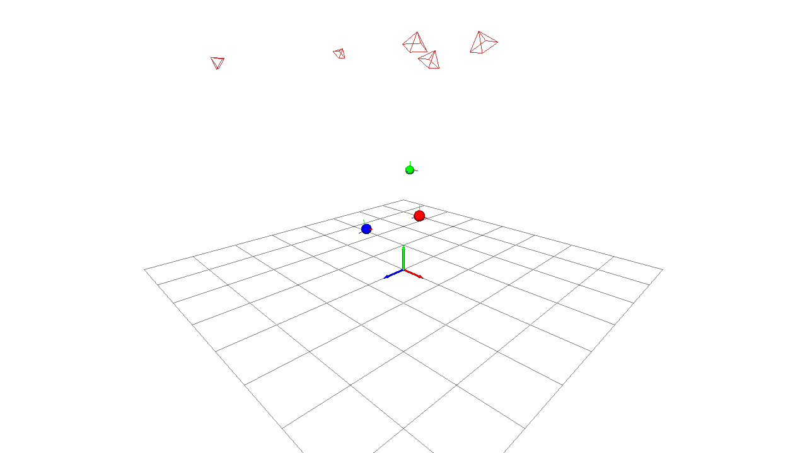

# Multi-Camera Marker Tracking

A real-time ArUco marker tracking and visualization system for multi-camera setups. Designed for robot navigation with ROS-compatible architecture.



*3D visualization showing marker spheres with orientation axes, camera frustums, and coordinate frame*

## Features

- **Multi-camera marker tracking** with pose fusion from multiple viewpoints
- **Real-time 3D visualization** with Open3D showing markers, camera frustums, and detection lines
- **ArUco marker generator** for creating printable markers
- **Orbbec camera integration** for RGB-D marker tracking
- **Network camera streaming** for remote Orbbec cameras via ZMQ
- **3D pose estimation** with solvePnP for accurate marker positioning
- **Pose fusion algorithms**: weighted average, median, or least squares
- **Calibration file support** for multi-camera setups with reference camera
- **Marker orientation visualization** with XYZ axes (red=X, green=Y, blue=Z)
- **Detection line visualization** showing which cameras see each marker
- **Integrated viewer** with 3D visualization and camera status panel
- **Simulated tracker** for testing without camera hardware
- **Multiple motion patterns**: circular, linear, figure-8, random walk
- **Pub/sub architecture** ready for ROS migration
- Camera pose visualization from calibration or sensor configuration files
- Marker trajectory trails with configurable length
- 60+ FPS network streaming with JPEG compression
- 30Hz tracking rate for robot navigation

## Project Structure

```
MultiCameraMakerTracking/
├── src/
│   ├── core/           # Message bus, data types, config loader
│   ├── markers/        # ArUco marker generation
│   ├── tracking/       # Tracker implementations
│   │   ├── simulated_tracker.py      # Simulated markers for testing
│   │   ├── orbbec_tracker.py         # Single Orbbec camera tracking
│   │   ├── network_tracker.py        # Network camera tracking
│   │   ├── multi_camera_tracker.py   # Multi-camera with fusion
│   │   └── pose_fusion.py            # Pose fusion algorithms
│   ├── streaming/      # Network video streaming (ZMQ-based)
│   └── visualization/  # Open3D viewer and scene management
│       ├── viewer.py                 # Main 3D viewer
│       ├── scene_manager.py          # Scene geometry management
│       ├── integrated_viewer.py      # 3D + camera status panel
│       └── multi_camera_preview.py   # Camera grid preview
├── scripts/
│   ├── run_full_system.py                        # Simulated tracking demo
│   ├── run_orbbec_tracker.py                     # Orbbec camera tracking
│   ├── run_network_tracker.py                    # Network camera tracking (2D)
│   ├── run_network_tracker_with_visualization.py # Network tracking with 3D viz
│   ├── run_multi_camera_tracker.py               # Multi-camera fusion tracking
│   ├── run_camera_preview.py                     # Standalone camera preview
│   ├── stream_client_standalone.py               # Client to copy to remote machines
│   └── generate_markers.py                       # Generate printable markers
├── docs/
│   └── NETWORK_STREAMING.md    # Network streaming documentation
├── calibration/        # Camera calibration files
├── config/             # Camera configurations (legacy)
├── markers/            # Generated marker images (output)
├── main.py             # Legacy Plotly visualization
└── requirements.txt
```

## Requirements

- Python 3.x
- numpy
- open3d
- opencv-contrib-python (for ArUco detection)
- pyzmq (for network streaming)
- matplotlib (optional, for legacy visualization)
- plotly (optional, for legacy visualization)
- pyorbbecsdk (optional, for Orbbec cameras)

## Installation

```bash
pip install -r requirements.txt
```

For Orbbec camera support:
```bash
pip install pyorbbecsdk
```

## Usage

### 1. Generate Printable Markers

First, generate ArUco markers to print:

```bash
# Generate markers 0-3 as individual files
python scripts/generate_markers.py --id 0 1 2 3

# Generate a sheet with markers for easy printing
python scripts/generate_markers.py --sheet --id 0 1 2 3 4 5 6 7

# Generate 50mm markers at 300 DPI for accurate physical size
python scripts/generate_markers.py --size-mm 50 --dpi 300 --id 0 1 2

# List available ArUco dictionaries
python scripts/generate_markers.py --list-dicts
```

Output files are saved to `markers/` directory by default.

### 2. Track with Orbbec Camera

Run real marker tracking with an Orbbec RGB-D camera:

```bash
# Basic tracking with 3D visualization
python scripts/run_orbbec_tracker.py

# Track 50mm markers (must match printed marker size!)
python scripts/run_orbbec_tracker.py --marker-size 0.05

# Show camera preview with detections
python scripts/run_orbbec_tracker.py --preview

# Use specific ArUco dictionary (must match generated markers!)
python scripts/run_orbbec_tracker.py --dict DICT_4X4_50
```

Options:
```
--marker-size M     Physical marker size in meters (default: 0.05 = 50mm)
--dict TYPE         ArUco dictionary type (default: DICT_4X4_50)
--preview           Show camera preview window with detections
--no-visualization  Disable 3D Open3D visualization
--camera-config     Path to camera config with extrinsic matrix
```

### 3. Network Camera Streaming (Remote Orbbec Cameras)

Track markers from cameras on remote machines over the network:

```bash
# First time: copy the standalone client to remote machine
scp scripts/stream_client_standalone.py determtech@192.168.1.80:~/stream_client.py

# On remote machine (192.168.1.80) - start the stream client
python3 stream_client.py --server <YOUR_LOCAL_IP> --camera-id cam1 --start-docker

# On local machine - start the tracker with preview
DISPLAY=:1 python3 scripts/run_network_tracker.py --preview
```

#### Network Tracking with 3D Visualization

For full 3D visualization with pose estimation and video preview:

```bash
# Run with calibration file, video preview, and 3D visualization
DISPLAY=:1 python3 scripts/run_network_tracker_with_visualization.py \
    --calibration calibration/calibration_result.json \
    --reference 250514 \
    --camera-filter cam \
    --preview
```

Options:
```
--calibration PATH  Path to calibration_result.json with camera extrinsics
--reference ID      Camera ID substring to use as origin (default: 250514)
--camera-filter ID  Only process cameras with this substring in ID
--marker-size M     Physical marker size in meters (default: 0.05)
--preview           Show video preview window with pose overlay
--no-visualization  Disable 3D visualization (console output only)
```

This shows:
- **Video Preview**: Live camera feed with marker detection, pose axes, and 3D position
- **3D Visualization**: Open3D window with camera frustums, markers, and trajectories

**Quick Commands**:
```bash
# Stop tracker
pkill -f run_network_tracker

# Restart tracker
pkill -f run_network_tracker && sleep 2 && DISPLAY=:1 python3 scripts/run_network_tracker.py --preview
```

For full setup instructions, see [docs/NETWORK_STREAMING.md](docs/NETWORK_STREAMING.md).

### 4. Multi-Camera Tracking with Pose Fusion

Track markers across multiple cameras simultaneously with pose fusion for improved accuracy:

```bash
# Start stream clients on each camera (on remote machines)
python stream_client.py --server 192.168.1.195 --camera-id SZVIDS-250515-...
python stream_client.py --server 192.168.1.195 --camera-id SZVIDS-250513-...
python stream_client.py --server 192.168.1.195 --camera-id SZVIDS-250514-...

# Run multi-camera tracker with 3D visualization
DISPLAY=:1 python3 scripts/run_multi_camera_tracker.py \
    --calibration calibration/calibration_result.json \
    --reference 250514

# With integrated viewer (3D + camera status panel)
DISPLAY=:1 python3 scripts/run_multi_camera_tracker.py \
    --calibration calibration/calibration_result.json \
    --reference 250514 \
    --preview
```

Options:
```
--calibration PATH  Path to calibration_result.json (required)
--reference ID      Camera ID substring for coordinate origin (default: 250514)
--marker-size M     Physical marker size in meters (default: 0.05)
--dict TYPE         ArUco dictionary (DICT_4X4_50, DICT_4X4_100, etc.)
--fusion METHOD     Pose fusion method (default: weighted_average)
                    - weighted_average: Weight by confidence and inverse depth
                    - median: Take median position (outlier rejection)
                    - least_squares: Minimize reprojection error
--preview           Show integrated viewer with camera status panel
--no-visualization  Console output only (no 3D visualization)
--port PORT         Stream server port (default: 5555)
```

#### Pose Fusion Methods

| Method | Description | Best For |
|--------|-------------|----------|
| `weighted_average` | Weights detections by confidence and camera distance | General use |
| `median` | Takes median of all positions | Outlier rejection |
| `least_squares` | Minimizes reprojection error across all cameras | High accuracy |

#### Visualization Features

- **Detection lines**: Colored lines from marker to each detecting camera
- **Camera frustums**: 3D representation of camera poses and field of view
- **Marker spheres**: Position indicators with unique colors per marker
- **Orientation axes**: XYZ axes showing marker heading (red=X, green=Y, blue=Z)
- **Trajectory trails**: Movement history (toggle with 'T' key)

#### Quick Commands (Multi-Camera System)

**Server (tracking machine):**
```bash
# Start tracker with 3D visualization and camera feeds
DISPLAY=:1 python3 scripts/run_multi_camera_tracker.py \
    --calibration calibration/calibration_result.json \
    --reference 250514 \
    --preview

# Stop tracker
pkill -f run_multi_camera_tracker

# Force stop if stuck (kills all Python processes related to tracker)
pkill -9 -f run_multi_camera_tracker

# Restart tracker
pkill -f run_multi_camera_tracker && sleep 2 && \
    DISPLAY=:1 python3 scripts/run_multi_camera_tracker.py \
    --calibration calibration/calibration_result.json \
    --reference 250514 --preview
```

**Client (camera machines):**
```bash
# Start stream client (run on each camera machine)
python3 stream_client.py --server <SERVER_IP> --camera-id <CAMERA_ID>

# Example with Docker auto-start
python3 stream_client.py --server 192.168.1.195 --camera-id SZVIDS-250514-... --start-docker

# Stop stream client
pkill -f stream_client

# Force stop if stuck
pkill -9 -f stream_client

# Restart stream client
pkill -f stream_client && sleep 2 && \
    python3 stream_client.py --server <SERVER_IP> --camera-id <CAMERA_ID>
```

**Troubleshooting:**
```bash
# Check if tracker is running
ps aux | grep run_multi_camera_tracker

# Check if port 5555 is in use
lsof -i :5555

# Kill process using port 5555
fuser -k 5555/tcp

# View connected cameras (from tracker output)
# Look for "Connected cameras" lines in tracker output
```

### 5. Simulated Tracking (No Camera Required)

Test the system without hardware:

```bash
python scripts/run_full_system.py
```

Options:
```
--config PATH       Path to config directory (default: config)
--calibration PATH  Path to calibration_result.json (overrides --config)
--reference ID      Camera ID substring to use as origin (e.g., "250514")
--num-markers N     Number of simulated markers (default: 3)
--motion TYPE       Motion type: circular, linear, figure8, random (default: circular)
--no-trajectory     Disable marker trails
--speed SPEED       Motion speed multiplier (default: 1.0)
--rate HZ           Tracker update rate (default: 30.0)
```

Examples:
```bash
# 5 markers moving in figure-8 pattern
python scripts/run_full_system.py --num-markers 5 --motion figure8

# Fast random motion without trails
python scripts/run_full_system.py --motion random --speed 2.0 --no-trajectory

# Use calibration file with reference camera as origin
python scripts/run_full_system.py --calibration calibration/calibration_result.json --reference 250514
```

### Keyboard Controls

| Key | Action |
|-----|--------|
| Q / ESC | Quit |
| P | Pause/Resume |
| R | Reset camera view |
| C | Clear marker trails |
| T | Toggle trail visibility |

### Legacy Visualization (Plotly)

```bash
python main.py
```

Opens an interactive 3D view in your browser.

## Configuration

### Calibration File (Recommended)

Place a `calibration_result.json` file in the `calibration/` directory:

```json
{
    "CalibrationTime": "2025-12-11 16:41:22",
    "NumberOfCalibratedCameras": 3,
    "CalibratedCameras": [
        {
            "CameraIndex": 0,
            "CameraID": "SZVIDS-250515-EAA839-91E21B-292366",
            "CameraType": "Orbbec",
            "CameraExtrinsic": "-0.98, 0.19, -0.02, -1.42, 0.04, 0.08, -1.0, 3.7, ..."
        }
    ]
}
```

The `CameraExtrinsic` field contains 16 comma-separated values representing a 4x4 transformation matrix.

Use with `--calibration` and `--reference` flags to specify a reference camera as the world origin.

### Legacy Configuration

Place camera configuration folders in the `config/` directory:

```
config/
├── SZVIDS-250515-DB77B5-8F194B-9AF224/
│   └── sensor_config.json
├── SZVIDS-250513-21892C-CAEB69-EC3063/
│   └── sensor_config.json
└── ...
```

Each `sensor_config.json` must contain a `Sensor to World Extrinsic` 4x4 transformation matrix.

## Architecture

The system uses a pub/sub message bus pattern designed for ROS compatibility:

### Single Camera Mode
```
Tracker (30Hz) -----> MessageBus -----> MarkerViewer (60Hz)
                   /markers/poses
```

### Multi-Camera Mode with Pose Fusion
```
┌─────────────┐  ┌─────────────┐  ┌─────────────┐
│  Camera 1   │  │  Camera 2   │  │  Camera 3   │
│ (streaming) │  │ (streaming) │  │ (streaming) │
└──────┬──────┘  └──────┬──────┘  └──────┬──────┘
       │                │                │
       └────────────────┼────────────────┘
                        ▼
              ┌─────────────────┐
              │  StreamServer   │
              │ (receives all)  │
              └────────┬────────┘
                       ▼
              ┌─────────────────┐
              │MultiCameraTracker│
              │ - Per-cam detect │
              │ - Detection sync │
              └────────┬────────┘
                       ▼
              ┌─────────────────┐
              │   PoseFusion    │
              │ - Weighted avg  │
              │ - Multi-view    │
              └────────┬────────┘
                       ▼
              ┌─────────────────┐
              │   MessageBus    │
              │/markers/fused   │
              └────────┬────────┘
                       ▼
              ┌─────────────────┐
              │  MarkerViewer   │
              │ - 3D marker pos │
              │ - Detection lines│
              └─────────────────┘
```

### Marker Visualization

Each marker is displayed with:
- **Colored sphere**: Position indicator (colors cycle through red, green, blue, yellow, magenta, cyan, orange, purple)
- **XYZ axes**: Orientation indicator showing marker heading
  - Red axis = X (right)
  - Green axis = Y (up)
  - Blue axis = Z (forward)
- **Trajectory trail**: Movement history (optional, toggle with 'T' key)

### Future ROS Migration

The `MessageBus` class can be swapped with a ROS-based implementation:
- Topics map to ROS topics
- `MarkerPose` maps to `geometry_msgs/PoseStamped`
- `spin_once()` maps to `rospy.spin()`

## Coordinate System

- **X-axis**: Left to right
- **Y-axis**: Up
- **Z-axis**: Front to back
